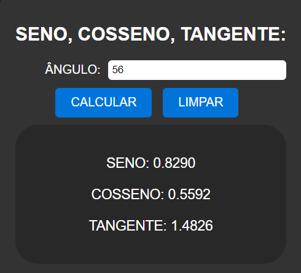

# CALCULAR SCT
🆎CALCULADORA DE SENO, COSSENO, TANGENTE EM HTML, CSS E JS.

 <br>

## DESCRIÇÃO:
Este projeto consiste em uma calculadora de funções trigonométricas básicas (seno, cosseno e tangente) para um determinado ângulo em graus. Aqui estão as principais funcionalidades implementadas:

1. Inserir Ângulo:
   - Digite o ângulo em graus no campo "ÂNGULO".

2. Calcular:
   - Clique no botão "CALCULAR" para calcular o seno, cosseno e tangente do ângulo inserido.
   - Os resultados serão exibidos abaixo do botão, fornecendo os valores calculados para seno, cosseno e tangente.

3. Limpar Campos:
   - Se desejar limpar o campo de entrada e os resultados, clique no botão "LIMPAR".
   - Isso restaurará o campo de entrada para seu valor padrão e ocultará os resultados.

## COMO USAR?
### BAIXANDO O PROJETO:
* Clone o repositório para o seu sistema local:

```bash
git clone https://github.com/VILHALVA/CALCULAR-SCT.git
```

* Navegue até o diretório do projeto.

```bash
cd CALCULAR-SCT
```

* Descompacte o arquivo ZIP (se você baixou manualmente):

```bash
unzip CALCULAR-SCT.zip
```

* Abra o arquivo `CODIGO.html` em seu navegador de preferência.

### EXECUTANDO O PROJETO:
1. Inserir Ângulo:
   - Digite o ângulo em graus no campo "ÂNGULO".

2. Calcular:
   - Clique no botão "CALCULAR" para calcular o seno, cosseno e tangente do ângulo inserido.
   - Os resultados serão exibidos abaixo do botão, fornecendo os valores calculados para seno, cosseno e tangente.

3. Limpar Campos:
   - Se desejar limpar o campo de entrada e os resultados, clique no botão "LIMPAR".
   - Isso restaurará o campo de entrada para seu valor padrão e ocultará os resultados.

## NÃO SABE?
- Entendemos que para manipular arquivos em `HTML`, `CSS` e outras linguagens relacionadas, é necessário possuir conhecimento nessas áreas. Para auxiliar nesse aprendizado, oferecemos cursos gratuitos disponíveis:
* [Curso de HTML e CSS](https://github.com/VILHALVA/CURSO-DE-HTML-E-CSS)
* [Curso de JavaScript](https://github.com/VILHALVA/CURSO-DE-JAVASCRIPT)
* [Confira mais cursos](https://github.com/VILHALVA?tab=repositories&q=+topic:CURSO)

## CREDITOS:
- [PROJETO CRIADO PELO VILHALVA](https://github.com/VILHALVA)
- [ESTÁ DISPONIVEL NO SITE](https://vilhalva.github.io/STYLER/STYLER.html)

